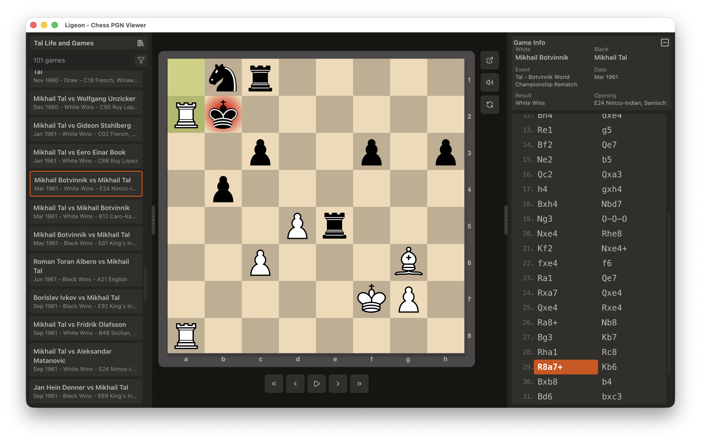

# Ligeon

Ligeon is a simple chess game browser / study tool built with [Electron](https://www.electronjs.org/) and [React](https://react.dev/). Import, browse and replay chess games from plain text PGN game files.

[](https://github.com/noahlz/ligeon/actions/workflows/ci.yml)



## Installation

**[Download](https://github.com/noahlz/ligeon/releases/latest)** the latest release for your platform.

> **Windows users:** The installer is not code-signed, so Windows Defender SmartScreen will show a warning. Click "More info" then "Run anyway" to proceed.

## Motivation

My chess coach recommended reviewing master game collections to learn patterns and opening themes. However, existing free browsers are limited: ChessBase is expensive, SCID vs. PC had a dated interface and was hard to use, and Lichess studies are limited to 64 chapters.

So, rather than use any of these, I did what any reasonable person would do: build my own application.

> Mostly this was an experiment in using Claude Code to create a real Electron/React application. Lichess studies are still my tool of choice.

## Limitations

This app imports "plain" PGN data only. It does not pull in comments, variations or annotations. This is because such additions to chess game moves are generally considered creative work and thus copyright protected (mere game moves and headers are "facts" and thus not copyright-protected). 

**Additional design choices:**
- No nested variations (single-level branches only)
- Simple comments and basic annotations.
- No Stockfish engine integration (you should really analyze positions without an engine!)

If you need the full feature set of Lichess studies, this is not it. However, if you need that, you can easily push positions and full games up to Lichess for further analysis.

## Why "Ligeon?"

Its a **Li**chess-based P**GN** browser.

## Development

### Prerequisites

- Node.js 24+
- npm

### Install Dependencies

```bash
npm install
```

### Run Tests

Run just the tests:
```bash
npm test
```

To run all TypeScript checks, ES linting, dead code detection (knip) and vitest coverage checks:
```bash
npm run check
```

### Run Dev App

Launch the Electron app with hot-reload:

```bash
npm run app
```

### Package 

```bash
npm run package
```

Creates distributable app bundles in `release/`.

### Release

```bash
npm run release
```

## CLI Tool: PGN to SQLite

Convert PGN files to SQLite databases for exploration and testing.

Usage:
```bash
npm run pgn-to-sqlite -- <pgn-file> [output-dir]
```

Example:
```bash
npm run pgn-to-sqlite -- resources/sample-games/tal-life-and-games.pgn ./release
```

## Attribution

### Sample Games

Sample games sourced from [brianerdelyi/ChessPGN](https://github.com/brianerdelyi/ChessPGN)

### Sounds 

Sound files in `public/sounds/` copied from [Lichess](https://github.com/lichess-org/lila), licenced under [CC BY-NC-SA 4.0](https://creativecommons.org/licenses/by-nc-sa/4.0/) by EdinburghCollective.

See: [lichess-org/lila/COPYING.md](https://github.com/lichess-org/lila/blob/master/COPYING.md)

### Piece Sets

Chess piece SVGs in `public/pieces/` sourced from [lichess-org/lila](https://github.com/lichess-org/lila).

See: [lichess-org/lila/COPYING.md](https://github.com/lichess-org/lila/blob/master/COPYING.md)

| Set | Author | License |
|-----|--------|---------|
| **cburnett** | [Colin M.L. Burnett](https://en.wikipedia.org/wiki/User:Cburnett) | [GPLv2+](https://www.gnu.org/licenses/old-licenses/gpl-2.0.html) |
| **merida** | Armando Hernandez Marroquin | [GPLv2+](https://www.gnu.org/licenses/old-licenses/gpl-2.0.html) |
| **alpha** | Eric Bentzen | Free for personal non-commercial use |
| **companion** | David L. Brown | Freeware |
| **fresca** | sadsnake1 | [CC BY-NC-SA 4.0](https://creativecommons.org/licenses/by-nc-sa/4.0/) |
| **mpchess** | [Maxime Chupin](https://github.com/chupinmaxime) | [GPL3v3+](https://www.gnu.org/licenses/quick-guide-gplv3.en.html) |
| **xkcd** | [Randall Munroe](https://xkcd.com/about) | [CC BY-NC-SA 2.5](https://xkcd.com/license.html) |

### Icons

This application uses [Lucide](https://lucide.dev/) icons, including for the application logo. [License](https://lucide.dev/license)

## Authors

[@noahlz](https://github.com/noahlz) ([Lichess profile](https://lichess.org/@/noahlz))  
[@claude](https://github.com/claude)  

## License

[GPLv3](./LICENSE) (because it uses Chessground)

